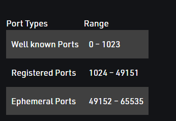
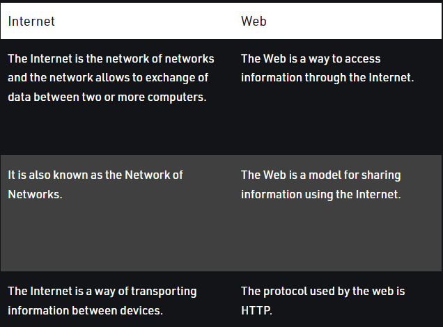

# Basics of Computer Networking

### Computer Network
An interconnection of multiple devices, also known as hosts, that are connected using multiple paths for the purpose of sending/receiving data or media.


### Network Topology
Bus, Star, Mesh, Ring, and Daisy chain. 


### OSI
OSI stands for Open Systems Interconnection. It is a reference model that specifies standards for communications protocols and also the functionalities of each layer. 

### UNIQUE IDENTIFIERS OF NETWORK 
* `Host name:` 
Each device in the network is associated with a unique device name known as Hostname. 
Type **“hostname”** in the command prompt(Administrator Mode) and press ‘Enter’, this displays the hostname of your machine. 


* `IP Address (Internet Protocol address):`
Also known as the Logical Address, the IP Address is the network address of the system across the network. 
Type **“ipconfig”** in the command prompt and press ‘Enter’, this gives us the IP address of the device. 

* `MAC Address (Media Access Control address): `
Also known as physical address, the MAC Address is the unique identifier of each host and is associated with its **NIC (Network Interface Card)**. 
A MAC address is assigned to the NIC at the time of manufacturing. 
The length of the MAC address is : 12-nibble/ 6 bytes/ 48 bits 
Type **“ipconfig/all”** in the command prompt and press ‘Enter’, this gives us the MAC address. 

* `Port :`
A port can be referred to as a logical channel through which data can be sent/received to an application.
A port number is a 16-bit integer, hence, we have 216 ports available which are categorized as shown below: 

Type **“netstat -a”** in the command prompt and press ‘Enter’, this lists all the ports being used. 


* `Socket: `
The unique combination of IP address and Port number together are termed as Socket. 

* `DNS Server: `
DNS stands for Domain Name system. 
DNS is basically a server which translates web addresses or URLs (ex: www.google.com) into their corresponding IP addresses. 
The command **‘nslookup’** gives you the IP address of the domain you are looking for.


* `ARP: `
ARP stands for **Address Resolution Protocol.**
It is used to convert an IP address to its corresponding physical address(i.e., MAC Address). 
ARP is used by the Data Link Layer to identify the MAC address of the Receiver’s machine. 

* `RARP: `
RARP stands for **Reverse Address Resolution Protocol.** 
As the name suggests, it provides the IP address of the device given a physical address as input.


# The Internet and the Web

#### Internet
Internet is a global network comprised of smaller networks that are interconnected using standardized communication protocols

### The World Wide Web: 
The Web is the only way to access information through the Internet. It’s a system of Internet servers that support specially formatted documents. The documents are formatted in a markup language called **HTML**.


### Who governs the Internet? 
The Internet is not governed and has no single authority figure. The ultimate authority for where the Internet is going rests with the **Internet Society, or ISOC.** 
ISOC is a voluntary membership organization whose purpose is to promote global information exchange through Internet technology.  
* **ISOC** appoints the **IAB- Internet Architecture Board.** They meet regularly to review standards and allocate resources, like addresses.
* **IETF- Internet Engineering Task Force.** Another volunteer organization that meets regularly to discuss operational and technical problems. 

# Unknown facts of Networking 

### Some interesting facts about computer networking are: 
* Internet was invented by **ARPANET in 1983.**
* Internet is controlled by **75 million servers.**
* The backbone of the internet is made by **550, 000 miles of underwater cable.**
* Approximately **204 million emails per minute are sent over the Internet. 70% of them are spam.**
* **269 billion emails are sent per day.**
* **30, 000 websites are hacked every day.**

# Line Configuration in Computer Networks

### Connections
* `Point-to-Point Connection :  `
A point-to-point connection provides a dedicated link between two devices.
The entire capacity of the link is reserved for transmission between those two devices.
Example: Point-to-Point connection between the remote control and Television for changing the channels. 

* `Multipoint Connection :  `
It is also called **Multidrop configuration**. In this connection, two or more devices share a single link.

**Spatial Sharing**: If several devices can share the link simultaneously, it’s called Spatially shared line configuration. 
**Temporal (Time) Sharing**: If users must take turns using the link, then it’s called **Temporally shared or Time Shared Line configuration**

# Transmission Modes
Transmission mode means transferring data between two devices.


* `Simple Mode:`
In Simplex mode, the communication is **unidirectional**, as on a one-way street.  
Example: **Keyboard and traditional monitors**. The keyboard can only introduce input, the monitor can only give the output. 


* `Half-Duplex Mode :`
In half-duplex mode, each station can both transmit and receive, but not at the same time. When one device is sending, the other can only receive, and vice versa.
Example: **Walkie-talkie** in which message is sent one at a time and messages are sent in both directions.
```
Channel capacity = Bandwidth * Propagation Delay
```


* `Full-Duplex Mode: `
In full-duplex mode, both stations can transmit and receive simultaneously.The capacity of the channel, however, must be divided between the two directions. 
Example: Telephone Network
```
Channel Capacity = 2 * Bandwidth * propagation Delay
```


# Types of Transmission Media
Transmission medium is a physical path between the transmitter and the receiver


###  Guided Media
It is also referred to as Wired or Bounded transmission media.
`Features:  `
* High Speed
* Secure
* Used for comparatively shorter distances

##### Types of Guided Media
* `Twisted Pair Cable`
It consists of 2 separately insulated conductor wires wound about each other. Generally, several such pairs are bundled together in a protective sheath.
* `Unshielded Twisted Pair (UTP)`
UTP consists of two insulated copper wires twisted around one another. This type of cable has the ability to block interference and does not depend on a physical shield for this purpose. It is used for telephonic applications.

* `Shielded Twisted Pair (STP): `
This type of cable consists of a special jacket (a copper braid covering or a foil shield) to block external interference. It is used in fast-data-rate Ethernet and in voice and data channels of telephone lines.

*  `Coaxial Cable`
It has an outer plastic covering containing an insulation layer made of PVC or Teflon and 2 parallel conductors each having a separate insulated protection cover. The coaxial cable transmits information in two modes: Baseband mode(dedicated cable bandwidth) and Broadband mode(cable bandwidth is split into separate ranges). Cable TVs and analog television networks widely use Coaxial cables. 

* `Optical Fiber Cable`
It uses the concept of reflection of light through a core made up of glass or plastic. The core is surrounded by a less dense glass or plastic covering called the cladding. It is used for the transmission of large volumes of data. 


### UnGuided Media
It is also referred to as Wireless or Unbounded transmission media. No physical medium is required for the transmission of electromagnetic signals. 
Features:  
* The signal is broadcasted through air
* Less Secure
* Used for larger distances

##### Types of UnGuided Media
* `Radio Waves`
These are easy to generate and can penetrate through buildings. The sending and receiving antennas need not be aligned. Frequency **Range:3KHz – 1GHz**.


* `Microwaves`
It is a line of sight transmission i.e. the sending and receiving antennas need to be properly aligned with each other. The distance covered by the signal is directly proportional to the height of the antenna. Frequency **Range:1GHz – 300GHz.**


* `Infrared`
Infrared waves are used for very short distance communication. They cannot penetrate through obstacles. This prevents interference between systems. **Frequency Range:300GHz – 400THz. It is used in TV remotes, wireless mouse, keyboard, printer, etc.**


# Unicast, Broadcast and Multicast

### Unicast
This type of information transfer is useful when there is a participation of a single sender and a single recipient. So, in short, you can term it as a one-to-one transmission. For example, if a device having IP address 10.1.2.0 in a network wants to send the traffic stream(data packets) to the device with IP address 20.12.4.2 in the other network, then unicast comes into the picture. This is the most common form of data transfer over the networks. 


### Broadcast
Broadcasting transfer (one-to-all) techniques can be classified into two types : 
* `Limited Broadcasting`
Suppose you have to send a stream of packets to all the devices over the network that you reside, this broadcasting comes in handy. For this to achieve, it will append **255.255.255.255 (all the 32 bits of IP address set to 1) called as Limited Broadcast Address** in the destination address of the datagram (packet) header which is reserved for information transfer to all the recipients from a single client (sender) over the network. 


* `Direct Broadcasting`
This is useful when a device in one network wants to transfer packet stream to all the devices over the other network. This is achieved by translating all the **Host ID part bits of the destination address to 1,** referred to as Direct Broadcast Address in the datagram header for information transfer.


### Multicast
In multicasting, one/more senders and one/more recipients participate in data transfer traffic.
IP multicast requires the support of some other protocols like IGMP (Internet Group Management Protocol), Multicast routing for its working. Also in Classful IP addressing Class D is reserved for multicast groups. 

# Network Topologies

### Mesh Topology
In a mesh topology, every device is connected to another device via a particular channel. In Mesh Topology, the protocols used are AHCP (Ad Hoc Configuration Protocols), DHCP (Dynamic Host Configuration Protocol), etc.


```
N = number of devices connected in mesh topology
number of ports required by each device = N-1
total number of ports required = N*(N-1)
total number of links required = NC2 = N*(N-1) / 2
```

`Advantages`
* It is Robust.
* The fault is diagnosed easily. Data is reliable because data is transferred among the devices through dedicated channels or links.
* Provides security and privacy.

`Disadvantages`
* Installation and configuration are difficult.
* The cost of cables is high
* The cost of maintenance is high.

### Star Topology
In star topology, all the devices are connected to a single hub through a cable. This hub is the central node and all other nodes are connected to the central node. In Star Topology, many popular Ethernet LAN protocols are used as CD(Collision Detection), CSMA (Carrier Sense Multiple Access), etc.


```
N = number of devices connected in mesh topology
number of ports required by each device = 1
total number of ports required = N
total number of links required = N
```

`Disadvantages`
* If the concentrator (hub) on which the whole topology relies fails, the whole system will crash down.
* The cost of installation is high.
* Performance is based on the single concentrator i.e. hub.

### Bus Topology
Bus topology is a network type in which every computer and network device is connected to a single cable. It transmits the data from one end to another in a single direction. No bi-directional feature is in bus topology. It is a multi-point connection and a non-robust topology because if the backbone fails the topology crashes. In Bus Topology, various MAC (Media Access Control) protocols are followed by LAN ethernet connections like TDMA, Pure Aloha, CDMA, Slotted Aloha, etc.


```
N = number of devices connected in mesh topology
number of ports required by each device = 1
total number of ports required = N
total number of links required = N+1
```

`Disadvantages`
* If the common cable fails, then the whole system will crash down.
* If the network traffic is heavy, it increases collisions in the network. To avoid this, various protocols are used in the MAC layer known as Pure Aloha, Slotted Aloha, CSMA/CD, etc.
* Security is very low.

### Ring Topology
In this topology, it forms a ring connecting devices with exactly two neighboring devices.
A number of repeaters are used for Ring topology with a large number of nodes.

The transmission is unidirectional, but it can be made bidirectional by having 2 connections between each Network Node, it is called Dual Ring Topology. In-Ring Topology, the Token Ring Passing protocol is used by the workstations to transmit the data.


The following operations take place in ring topology are : 
* One station is known as a monitor station which takes all the responsibility to perform the operations.
* To transmit the data, the station has to hold the token. After the transmission is done, the token is to be released for other stations to use.
* When no station is transmitting the data, then the token will circulate in the ring.
* There are two types of token release techniques: **Early token release** releases the token just after transmitting the data and **Delay token release** releases the token after the acknowledgment is received from the receiver.

`Advantages`
* The possibility of collision is minimum in this type of topology.
* Cheap to install and expand.

`Disadvantages`
* Troubleshooting is difficult in this topology.
* The addition of stations in between or removal of stations can disturb the whole topology.
* Less secure. 

### Tree Topology
This topology is the variation of the Star topology. This topology has a hierarchical flow of data. In Tree Topology, SAC (Standard Automatic Configuration ) protocols like DHCP and SAC are used.
  

`Advantages`
* It allows more devices to be attached to a single central hub thus it decreases the distance that is traveled by the signal to come to the devices.
* It allows the network to get isolated and also prioritize from different computers.

`Disadvantages`
* If the central hub gets fails the entire system fails.
* The cost is high because of cabling.

### Hybrid Topology
  

# Types of area networks – LAN, MAN and WAN
LAN, MAN, and WAN are the three major types of networks designed to operate over the area they cover. One of the major differences is the geographical area they cover, i.e. LAN covers the smallest area; MAN covers an area larger than LAN and WAN comprises the largest of all. 
There are other types of Computer Networks also, like : 
* PAN (Personal Area Network)
* SAN (Storage Area Network)
* EPN (Enterprise Private Network)
* VPN (Virtual Private Network)

### Local Area Network (LAN) 
LANs cover a smaller geographical area (Size is limited to a few kilometers) and are privately owned. One can use it for an office building, home, hospital, schools, etc.  
A Communication medium used for LAN has twisted-pair cables and coaxial cables. It covers a short distance, and so the error and noise are minimized.  
Early LANs had data rates in the 4 to 16 Mbps range. Today, speeds are normally 100 or 1000 Mbps

### Metropolitan Area Network (MAN)
MAN or Metropolitan area Network covers a larger area than that of a LAN and smaller area as compared to WAN. It connects two or more computers that are apart but reside in the same or different cities. It covers a large geographical area and may serve as an ISP (Internet Service Provider).
  

### Wide Area Network (WAN)
WAN or Wide Area Network is a computer network that extends over a large geographical area, although it might be confined within the bounds of a state or country.

# OSI Model
OSI stands for **Open Systems Interconnection.** It has been developed by **ISO – ‘International Organization for Standardization‘**, in the year **1984**. It is a 7 layer architecture with each layer having specific functionality to perform. 
  

### Physical Layer (Layer 1) :
The lowest layer of the OSI reference model is the physical layer. It is responsible for the actual physical connection between the devices. The physical layer contains information in the form of bits. It is responsible for transmitting individual bits from one node to the next.
  
The functions of the physical layer are as follows:  

* `Bit synchronization:` The physical layer provides the synchronization of the bits by providing a clock. This clock controls both sender and receiver thus providing synchronization at bit level.
* `Bit rate control:` The Physical layer also defines the transmission rate i.e. the number of bits sent per second.
* `Physical topologies:` Physical layer specifies the way in which the different, devices/nodes are arranged in a network i.e. bus, star, or mesh topology.
* `Transmission mode:` Physical layer also defines the way in which the data flows between the two connected devices. The various transmission modes possible are Simplex, half-duplex and full-duplex.

Hub, Repeater, Modem, Cables are Physical Layer devices.   
Network Layer, Data Link Layer, and Physical Layer are also known as **Lower Layers or Hardware Layers.**

### Data Link Layer (DLL) (Layer 2)
The data link layer is responsible for the node-to-node delivery of the message. The main function of this layer is to make sure data transfer is error-free from one node to another, over the physical layer. When a packet arrives in a network, it is the responsibility of DLL to transmit it to the Host using its MAC address.  
Data Link Layer is divided into two sublayers:  

* Logical Link Control (LLC)  
* Media Access Control (MAC)

The functions of the Data Link layer are :  
* `Framing:` Framing is a function of the data link layer. It provides a way for a sender to transmit a set of bits that are meaningful to the receiver. This can be accomplished by attaching special bit patterns to the beginning and end of the frame.
* `Physical addressing:` After creating frames, the Data link layer adds physical addresses (MAC address) of the sender and/or receiver in the header of each frame.  
* `Error control:` Data link layer provides the mechanism of error control in which it detects and retransmits damaged or lost frames.
* `Flow Control:` The data rate must be constant on both sides else the data may get corrupted thus, flow control coordinates the amount of data that can be sent before receiving acknowledgement.
* `Access control:` When a single communication channel is shared by multiple devices, the MAC sub-layer of the data link layer helps to determine which device has control over the channel at a given time.

### Network Layer (Layer 3)
The network layer works for the transmission of data from one host to the other located in different networks. It also takes care of packet routing i.e. selection of the shortest path to transmit the packet, from the number of routes available. The sender & receiver’s IP addresses are placed in the header by the network layer. 

The functions of the Network layer are :  
* `Routing:` The network layer protocols determine which route is suitable from source to destination.
* `Logical Addressing:` In order to identify each device on internetwork uniquely, the network layer defines an addressing scheme. The sender & receiver’s IP addresses are placed in the header by the network layer. Such an address distinguishes each device uniquely and universally.

### Transport Layer (Layer 4) 
The transport layer provides services to the application layer and takes services from the network layer. The data in the transport layer is referred to as Segments. It is responsible for the End to End Delivery of the complete message. The transport layer also provides the acknowledgement of the successful data transmission and re-transmits the data if an error is found.

The functions of the transport layer are as follows:  
* `Segmentation and Reassembly:` This layer accepts the message from the (session) layer, and breaks the message into smaller units. Each of the segments produced has a header associated with it. The transport layer at the destination station reassembles the message.
* `Service Point Addressing:` In order to deliver the message to the correct process, the transport layer header includes a type of address called service point address or port address. Thus by specifying this address, the transport layer makes sure that the message is delivered to the correct process.

### Session Layer (Layer 5)
This layer is responsible for the establishment of connection, maintenance of sessions, authentication, and also ensures security. 

The functions of the session layer are :  
* `Session establishment, maintenance, and termination:` The layer allows the two processes to establish, use and terminate a connection.
* `Synchronization:` This layer allows a process to add checkpoints which are considered synchronization points into the data. These synchronization points help to identify the error so that the data is re-synchronized properly, and ends of the messages are not cut prematurely and data loss is avoided.
* `Dialog Controller:` The session layer allows two systems to start communication with each other in half-duplex or full-duplex.

**All the below 3 layers(including Session Layer) are integrated as a single layer in the TCP/IP model as “Application Layer”.**

###  Presentation Layer (Layer 6)
The presentation layer is also called the **Translation layer**. The data from the application layer is extracted here and manipulated as per the required format to transmit over the network. 

###  Application Layer (Layer 7)
At the very top of the OSI Reference Model stack of layers, we find the Application layer which is implemented by the network applications. These applications produce the data, which has to be transferred over the network. This layer also serves as a window for the application services to access the network and for displaying the received information to the user. 

**OSI model acts as a reference model and is not implemented on the Internet because of its late invention. The current model being used is the TCP/IP model.**


# TCP/IP Model
TCP/IP model, it was designed and developed by **Department of Defense (DoD) in 1960s**and is based on standard protocols. It stands for **Transmission Control Protocol/Internet Protocol**. The TCP/IP model is a concise version of the OSI model. It contains four layers, unlike seven layers in the OSI model. The layers are:
* Process/Application Layer
* Host-to-Host/Transport Layer
* Internet Layer
* Network Access/Link Layer


 